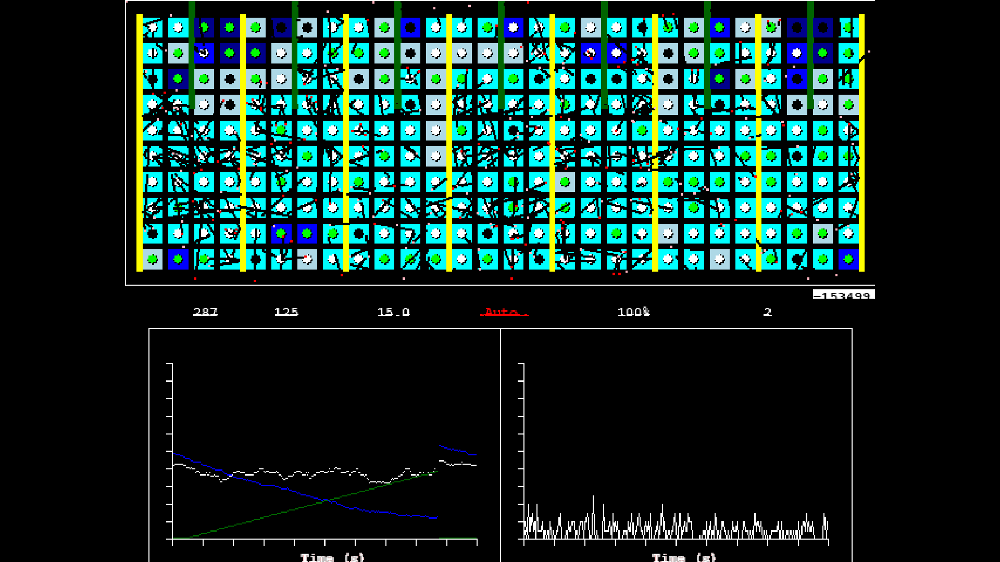

# RP2040 RBMK Nuclear Reactor Simulator



A real-time particle physics simulation of a Chernobyl-style RBMK nuclear reactor running on a Raspberry Pi Pico (RP2040).

The Pico handles the heavy lifting: it calculates neutron diffusion, uranium fission events, xenon poisoning, and thermal dynamics in real-time. Instead of driving a VGA display directly, it sends high-speed telemetry data over USB Serial to a PC, where a Python/Pygame script renders the display in full screen.

## 🚀 Features
* **Particle Physics Engine:** Simulates individual neutrons interacting with fuel, moderators, and control rods.
* **Multithreaded Architecture:** Uses Protothreads to handle physics calculations, serial communication, and user inputs simultaneously.
* **Audio Synthesis:** Uses DMA (Direct Memory Access) to drive a DAC, generating Geiger-counter clicks and reactor hum without using the CPU.
* **Real-time Telemetry:** Live graphing of neutron flux, thermal capacity, and reaction history.
* **Physical Control Console:** Uses rotary encoders and buttons to manually operate control rods and cooling pumps.

## 🛠️ Hardware Required
* **1x Raspberry Pi Pico** (RP2040)
* **4x Rotary Encoders** (KY-040 or standard)
* **4x Push Buttons** (Tactile switches)
* **1x Breadboard**
* **Jumper Wires** (Male-to-Male)
* **(Optional) Audio:** MCP4822 DAC + Speaker

## 🔌 Wiring Guide / Pinout

Connect the components to the Pico using the pins defined below.
* **Power:** Connect the **3.3V (Pin 36)** to the Red Rail and **GND (Pin 38)** to the Blue Rail of your breadboard.
* **Encoders:** Connect all Encoder `+` to 3.3V and `GND` to the Ground Rail.

| Component | Function | CLK / Pin 1 | DT / Pin 2 | Pico GPIO | Physical Pins |
| :--- | :--- | :--- | :--- | :--- | :--- |
| **Encoder 1** | Manual Rod Control | CLK | DT | **GP27, GP26** | 32, 31 |
| **Encoder 2** | Water Flow Pump | CLK | DT | **GP6, GP7** | 9, 10 |
| **Encoder 3** | Neutron Target Set | CLK | DT | **GP28, GP22** | 34, 29 |
| **Encoder 4** | Reaction Multiplier | CLK | DT | **GP8, GP9** | 11, 12 |
| **Button 1** | **SCRAM** (Emergency) | Pin 1 | GND | **GP2** | 4 |
| **Button 2** | Auto/Manual Toggle | Pin 1 | GND | **GP4** | 6 |
| **Button 3** | Sync Position | Pin 1 | GND | **GP5** | 7 |
| **Button 4** | Sim Speed (50%/100%)| Pin 1 | GND | **GP3** | 5 |

> **Note:** Buttons connect directly between the GPIO pin and Ground. The code uses internal pull-up resistors.

### 🧠 System Resources Used
* **Core 0:** Physics Engine, Serial Output, Input Handling.
* **Core 1:** (Reserved for future charts/calculation offloading).
* **DMA Channel 1:** Transfers audio sine-wave table to SPI TX buffer.
* **DMA Channel 2:** Control channel (Chains to Ch1) to create a circular audio buffer.
* **SPI1:** Hardware interface for the Audio DAC (Pins 10, 11, 12, 13).

## 💻 Software Prerequisites

### 1. On your PC (Display)
You need Python installed to run the monitor script.
```bash
pip install pygame pyserial
```
### 2. On the Pico (Firmware)
You need the Raspberry Pi Pico C/C++ SDK.
* **Recommended:** Use **VS Code** with the official **"Raspberry Pi Pico"** extension.
* Ensure `CMake` and `Ninja` are installed on your system.

## ⚙️ How to Run

### Step 1: Build & Flash the Firmware
1. Open this project folder in **VS Code**.
2. Click **"Compile Project"** (or run `cmake` build) in the extension sidebar.
3. Unplug the Pico. Hold the **BOOTSEL** button and plug it in via USB.
4. Drag and drop the generated `build/reactor_sim.uf2` file onto the **RPI-RP2** drive.
5. The Pico will reboot and begin running the physics simulation immediately.

### Step 2: Start the Monitor
Open your terminal inside the project folder and run the Python display script.

**On Linux (Ubuntu/Debian):**
You typically need `sudo` permissions to access the USB serial port (`/dev/ttyACM0`).

```bash
sudo python3 reactor_monitor.py
```
